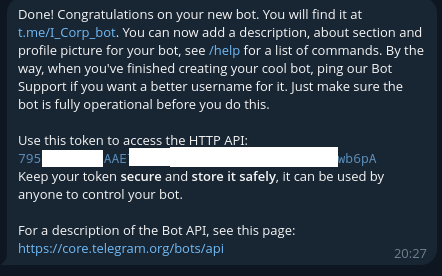

# Проект  TG бот

## Получение токена бота
Получить токен бота можно в [BotFather](https://t.me/botfather)
Отправить команду `/newbot` и следовать инструкциям

Полученный токен нужно вставить в переменную `BOT_TOKEN`

## Генерация секретного токена
Для вебхука необходимо сгенерировать секретный токен.
```python
import secrets
token = secrets.token_urlsafe(32)
print(token)
```
и вставить его в переменную `SECRET_TOKEN`

## Регистарция вебхука
Вебхук можно зарегистрировать в [BotFather](https://t.me/botfather)
Отправить команду `/setwebhook` и следовать инструкциям


или можно вручную с помощью curl:
```commandline
curl -X POST "https://api.telegram.org/bot<ваш_токен_бота>/setWebhook" \
     -H "Content-Type: application/json" \
     -d '{
           "url": "ваш_адрес_вебхука",
           "secret_token": "ваш_секретный_токен"
         }'
```